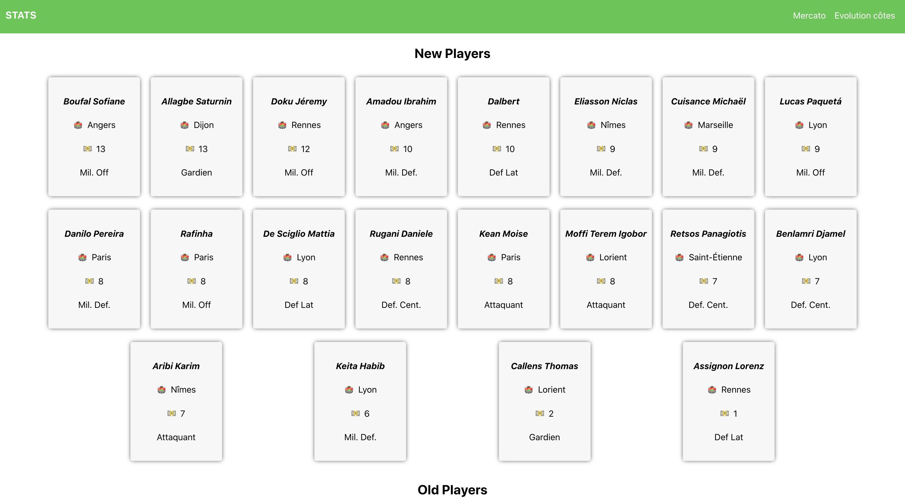

# MPG - Visualizer

## Goal
This repo aims to be better than your opponents in your MPG league

## How ?

### Get the data

`node ./scripts/fetchData` will get the current list of players (Ligue 1 only) and save it into a file in the `public/data` directory.

If you want to get data from a file in the App, go to `src/modules/players/PlayersClient.js` (this way you leave the MPG's API alone) and change the path of the files.

### Start the App

1. Install dependencies with `npm install`
2. Start the app with `npm start`
3. Go to `http://localhost:3000`

### Mercato changes

This page allows to quickly see the players who joined / left the league.

#### Features

- [x] See the departures / arrivals
- [ ] Select different dates ?
- [ ] Select league (PL/ Ligue 1, Serie A, Liga)
- [ ] Improve design because it could look way better

### Odds evolution

This page allows to see the price evolution for players

#### Features

- [ ] Select different dates ?
- [ ] Display the evolution for a player
- [ ] Search bar ?

## Dev
This project was bootstrapped with [Create React App](https://github.com/facebook/create-react-app).

## Available Scripts

In the project directory, you can run:

### `npm start`

Runs the app in the development mode. 
Open [http://localhost:3000](http://localhost:3000) to view it in the browser.

The page will reload if you make edits. 
You will also see any lint errors in the console.

### `npm test`

Launches the test runner in the interactive watch mode. 
See the section about [running tests](https://facebook.github.io/create-react-app/docs/running-tests) for more information.

### `npm run build`

Builds the app for production to the `build` folder. 
It correctly bundles React in production mode and optimizes the build for the best performance.

The build is minified and the filenames include the hashes. 
Your app is ready to be deployed!

See the section about [deployment](https://facebook.github.io/create-react-app/docs/deployment) for more information.

